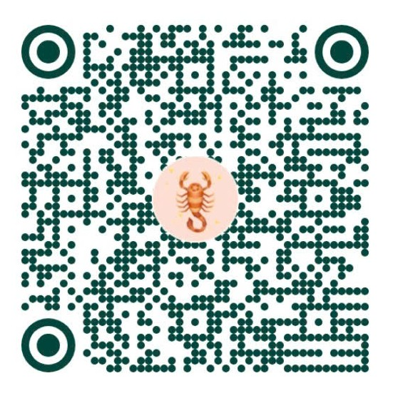

# Ủng hộ tác giả

---

## ☕ Mời cà phê tác giả

Nếu bạn thấy công cụ **Ghép & Chuẩn Hóa Dữ Liệu KSK HIS (nsn-his-excel-matcher)** hữu ích cho công việc hàng ngày, hãy ủng hộ tác giả một ly cà phê nhé!

Trong app: nhấp nút **Tác giả & Cà phê** trên thanh điều hướng hoặc liên kết ở cuối trang (footer).

  

| | |
|---|---|
| **Chủ tài khoản** | **NGUYEN SON NAM** |
| **Số tài khoản** | **8855989777** |
| **Ngân hàng** | BIDV — PGD Nguyễn Tất Thành |
| **Cách chuyển** | Quét mã **VietQR** ở trên để chuyển nhanh qua mọi ứng dụng ngân hàng |

*Cảm ơn bạn đã luôn tin tưởng và đồng hành cùng hệ sinh thái ứng dụng y tế NSN!*

---

- **Tác giả:** Nguyễn Sơn Nam (Nsnnam / NamNS)
- **Zalo:** 0977059075
- **GitHub:** [https://github.com/Nsnnam](https://github.com/Nsnnam)
- **Repo:** [nsn-his-excel-matcher](https://github.com/Nsnnam/nsn-his-excel-matcher)
- **Phiên bản hiện tại:** `1.0.0` (2026-09-29)
